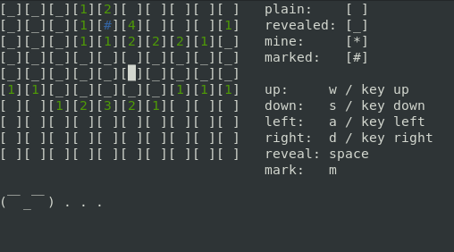

Minesweeper
-

Minesweeper c++ game.
Runs in terminal.



Options:
- `--help` `-h` Help
- `--mines` `-m` Percentage of mines on grid
- `--xsize` `-x` X size
- `--ysize` `-y` Y size

Example:
```
Minesweeper -x 30 -m 40
```

Dependencies:
- ncurses
